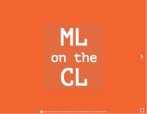

# Conference Talks, Workshops, and Other Presentations by Kylie Stewart

In the spirit of consolidating the various projects, slides, and abstracts I have scattered on my laptop, I've put together this repo to create a one-stop shop for my presentations, including relevant demos, slide decks, and other resources.

Inspired by [Jason Lengstorf](hhttps://lengstorf.com/)'s own [`presentations` repo](https://github.com/jlengstorf/presentations/).

## What’s In This Repo?

- [Bio and details](#about-kylie)
- [Technical session slides, details, and videos (when available)](#talks)
  <!-- - [Workshop slides and details](#workshops) -->
- [Videos of previous talks](#videos-of-previous-presentations)

## About Kylie

(This is what I send to people as my bio.)

### Short version

> Kylie Stewart is an engineer and occasional speaker. She is passionate about building tools and high-performing applications, as well as hiking with her dog. She lives in Denver, Colorado.

<!-- ### Long version

>

-->

## Talks

| Some                                           | of my                                                      | Talks                                                                            |
| ---------------------------------------------- | ---------------------------------------------------------- | -------------------------------------------------------------------------------- |
|       |  |                                            |
|  |  |  |

### React to React Native: How Hard Could It Be?

- [Slides](./react-to-react-native/slides/final.pdf)
- [Abstract and Resources](https://github.com/kale-stew/talks/tree/master/react-to-react-native)
- [Video][react-to-react-native]
- _(Presented on May 28th, 2019)_

### TypeScript in React: A Love Story ❤️

- [Slides](./ts-in-react/slides/final.pdf)
- [Abstract and Resources](https://github.com/kale-stew/talks/tree/master/ts-in-react)
- [Video][ts-in-react]
- _(Presented on April 16th, 2019)_

### Anything But JavaScript

- [Slides](./anything-but-js/slides/final.pdf)
- [Abstract and Resources](https://github.com/kale-stew/talks/tree/master/anything-but-js)
- _(Presented on @TODO, 2019)_

### How TypeScript Made Me a Better JavaScript Developer

- [Slides](./ts-is-awesome/slides/final.pdf)
- [Abstract and Resources](https://github.com/kale-stew/talks/tree/master/ts-is-awesome)
- _(Presented on October 25th, 2018)_

### ML on the CL

- [Slides](./ml-on-the-cl/slides/final.pdf)
- [Abstract and Resources](https://github.com/kale-stew/talks/tree/master/ml-on-the-cl)
- [Video](ml-on-the-cl)
- _(Presented on June 28th, 2018)_

### Using JavaScript to Teach Machines How to Do Cool Shit

- [Slides](./machine-learning-with-javascript/slides/final.pdf)
- [Abstract and Resources](https://github.com/kale-stew/talks/tree/master/machine-learning-with-javascript)
- [Video][machine-learning-with-javascript]
- _(Presented on April 28th, 2018)_

<!-- ## Workshops

### An Introduction to React Native -->

## Videos of Previous Presentations

- [ML on the CL][ml-on-the-cl]
- [React to React Native: How Hard Could It Be?][react-to-react-native]
- [TS in React: A Love Story][ts-in-react]
- [Using JavaScript to Teach Machines How to Do Cool Shit][machine-learning-with-javascript]

<!-- Linkz -->

[machine-learning-with-javascript]: https://youtu.be/QaV7a64mUYE
[ml-on-the-cl]: https://youtu.be/MzrDy4s8MF8
[react-to-react-native]: https://youtu.be/87trwew9Hik?t=1587
[ts-in-react]: https://youtu.be/iBlGIS-UQsw?t=1638
